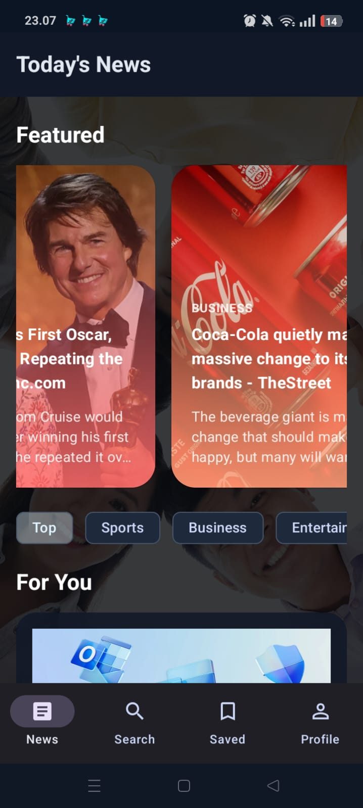
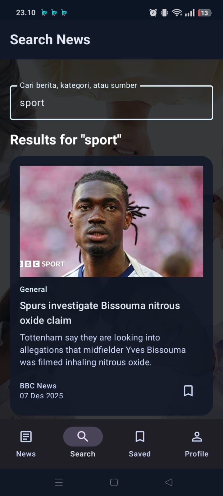
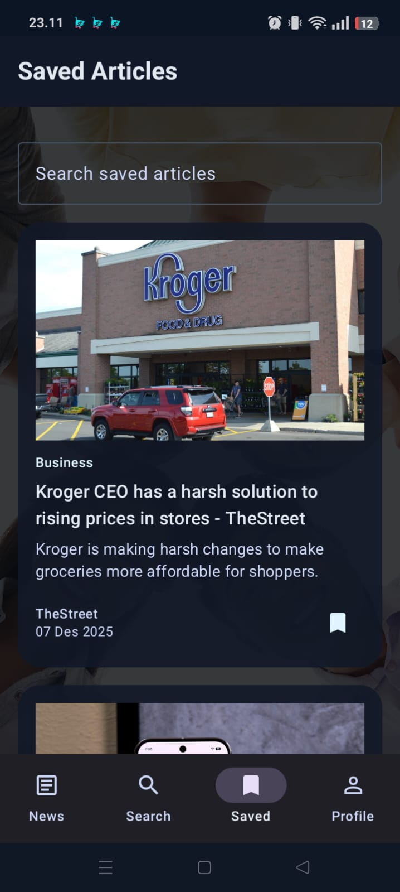
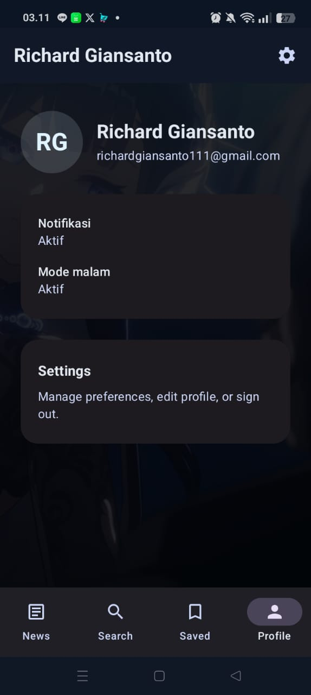
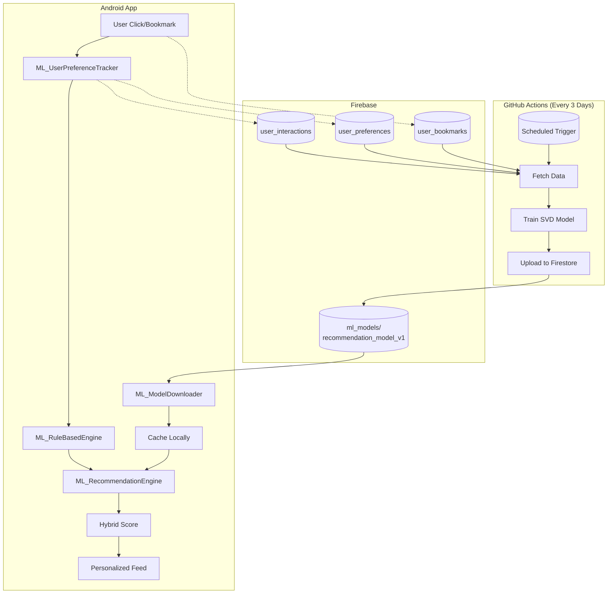

# 📰 NewsApp

A modern Android news application with ML-powered personalized article recommendations.

[](https://github.com/Gr1cLev/NewsApp/actions/workflows/train-ml-model.yml)

---

## ✨ Key Features

| Feature | Description |
|---------|-------------|
|  **Browse News** | Explore news by category (Sports, Business, Technology, etc.) |
|  **Search** | Search articles with real-time results |
|  **Bookmarks** | Save favorite articles per user profile |
|  **ML Recommendations** | Personalized articles using Collaborative Filtering |
|  **Authentication** | Login/register with Firebase Auth |
|  **Theming** | Dark/light mode toggle |
|  **Pull-to-refresh** | Refresh content with gesture |
---

## 📱 Screenshots

| Home | Search | Saved | Profile |
|:----:|:------:|:-----:|:-------:|
|  |  |  |  |

---

## 🏗️ Architecture

```
app/
├── data/           # Repository & data sources
├── di/             # Hilt dependency injection modules
├── ml/             # Machine learning components
│   ├── ML_RecommendationEngine.kt    # Hybrid scoring engine
│   ├── ML_RuleBasedEngine.kt         # Content-based filtering
│   ├── ML_UserPreferenceTracker.kt   # Real-time preference tracking
│   ├── ML_ModelDownloader.kt         # Model sync from Firestore
│   └── ML_ModelArtifacts.kt          # Model data structure
├── model/          # Data models
├── network/        # Retrofit API services
├── ui/             # Jetpack Compose screens
├── viewmodel/      # MVVM ViewModels
└── work/           # Background workers
```

---

## 🛠️ Tech Stack

| Layer | Technology |
|-------|------------|
| **Language** | Kotlin |
| **UI** | Jetpack Compose + Material3 |
| **Architecture** | MVVM + Clean Architecture |
| **DI** | Hilt |
| **Network** | Retrofit + OkHttp + Moshi |
| **Backend** | Firebase (Firestore, Auth, Analytics) |
| **ML** | SVD Collaborative Filtering |
| **CI/CD** | GitHub Actions |
| **Min SDK** | 24 (Android 7.0) |

---

## 🤖 Machine Learning System

### Flowchart



### Hybrid Scoring Formula

```
Final Score = (ML Score × 0.50) + (Rule Score × 0.30) + (Recency × 0.15) + (Trending × 0.05)
```

| Component | Weight | Source |
|-----------|--------|--------|
| **ML Score** | 50% | SVD dot product (user × article embeddings) |
| **Rule Score** | 30% | Real-time category preference tracking |
| **Recency** | 15% | Article publish timestamp |
| **Trending** | 5% | Global popularity |

### Automated Training

- **Schedule**: Every 3 days at 00:00 UTC
- **Trigger**: Automatically via GitHub Actions or manual
- **Algorithm**: Truncated SVD (scikit-learn)
- **Distribution**: Upload to Firestore → App auto-download

---

## 🚀 Quick Start

### 1. Clone & Setup

```bash
git clone https://github.com/Gr1cLev/NewsApp.git
cd NewsApp
```

### 2. Configure API Keys

Create `local.properties` file:
```properties
sdk.dir=C:\\Users\\YourName\\AppData\\Local\\Android\\Sdk
NEWS_API_KEY=your_newsapi_key_here
```

> 💡 Get a free API key at [newsapi.org](https://newsapi.org/register)

### 3. Setup Firebase

1. Download `google-services.json` from Firebase Console
2. Place it in the `app/` folder
3. Enable: Authentication, Firestore, Analytics

### 4. Build & Run

```bash
./gradlew clean build
```

---

## 📁 Project Structure

```
NewsApp/
├── app/                          # Android application
│   ├── src/main/java/.../ml/     # ML components
│   └── google-services.json      # Firebase config
├── ml_training/                  # ML training scripts
│   ├── train_model.py            # Automated training script
│   ├── requirements.txt          # Python dependencies
│   └── README.md                 # Training documentation
├── .github/workflows/
│   └── train-ml-model.yml        # GitHub Actions workflow
└── README.md                     # This file
```

---

## 📊 Firestore Collections

| Collection | Purpose |
|------------|---------|
| `user_interactions/{userId}/articles` | Click, reading time, bookmark data |
| `user_preferences/{userId}/ml_data/preferences` | Category scores & total interactions |
| `user_bookmarks/{userId}/bookmarks` | Saved articles |
| `ml_models/recommendation_model_v1` | Trained ML model artifacts |

---

## 🔐 Security

- ✅ API keys in `local.properties` (gitignored)
- ✅ Firebase service account in GitHub Secrets
- ✅ Firestore security rules per user
- ✅ HTTPS only connections

---

## 📚 Documentation

| Document | Description |
|----------|-------------|
| [ml_training/README.md](ml_training/README.md) | ML training documentation |
| [FIREBASE_SETUP.md](FIREBASE_SETUP.md) | Firebase configuration |
| [FIRESTORE_STRUCTURE.md](FIRESTORE_STRUCTURE.md) | Database schema |

---

## 🙏 Acknowledgments

- [NewsAPI.org](https://newsapi.org) - News data provider
- [Jetpack Compose](https://developer.android.com/jetpack/compose) - Modern UI toolkit
- [Firebase](https://firebase.google.com) - Backend infrastructure

---

**Last Updated**: December 14, 2025
